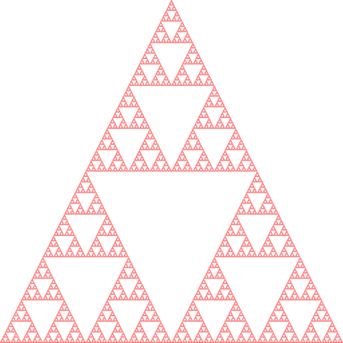

sierpinski
==========

Make beautiful Sierpinsky triangles using the Haskell Diagrams library.

Usage
-----

    sierpinsky -o [Outfile] -w [Width] [Shape] [Iterations]

    Shape: Shape used to build triangle
      Square, Circle or Triangle

    Iterations: number of iterations

Example
-------

    sierpinski -o 10-square.png -w 500 Square 10

